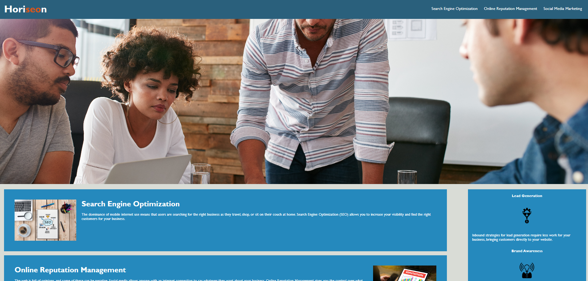
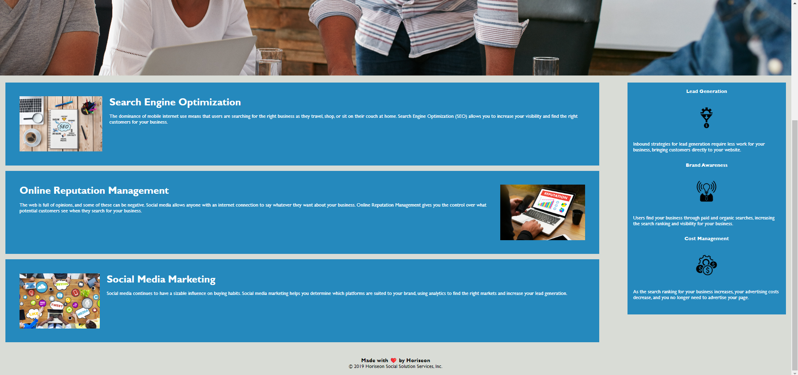

# Accessible-HTML

## Description 

Week 1's challenge involved editing an existing HTML and CSS file to be more accessible, adding alt tags to images as well as an aria-label for the hero banner image, which had been included using CSS rather than HTML (where alt tags could have been added). I have edited the title of the page to be more appropriate, and I have also condensed the CSS to include styles for particular nested elements, rather than having the same styles written for classes that are only applied once on a specific section of content.

## Screenshots

## Installation

Visit https://sarenne89.github.io/Accessible-HTML/ in your browser.

## Usage 

Links are non-functional as this was not part of the challenge, and are only placeholders. 

## Credits

edX Bootcamp instructors

## License

MIT License

---

© 2023 edX Boot Camps LLC. Confidential and Proprietary. All Rights Reserved.